<!--
IMAGES: assets/img/week03/ — captured from the live template Editor 20 Sep 2026 (01–08, 10, 10b done).
Still to capture by Kachi: 09-launch-window.png (Launch window with the lamp lit), 12-console.png (DevTools console, one red line),
13-gemini.png (Gemini reply with the code block's Copy button). Until they exist those three lines are captions, not images.
-->

# Week 3 · Exactly One Interaction

**This week's rule:** One interaction. It happens where your body is.
No buttons, no menus, nothing floating.
**By the end of today:** someone else has found your interaction without being told how.

| | |
|---|---|
| Template | [playcanvas.com/project/1594630/overview/vart3447template](https://playcanvas.com/project/1594630/overview/vart3447template) |
| Scripts as text | [proximity.mjs](../scripts/proximity.mjs) · [look-at.mjs](../scripts/look-at.mjs) · [grab.mjs](../scripts/grab.mjs) · [desk-walk.mjs](../scripts/desk-walk.mjs) · [xr-enter.mjs](../scripts/xr-enter.mjs) |
| Gemini page | [How to ask Gemini](../gemini.md) |
| Class board | [padlet.com/chankachi/vart3447](https://padlet.com/chankachi/vart3447) — **Week 03** column |

---

## Play

Headset on. **The Key** or **Elixir**.
One question after: *what was the one interaction, and where was your body?*

---

## Part 1 · This week's copy

1. Open your **week-2** project → **Fork** → name it `vart3447-w03-yourname` → **Editor**.

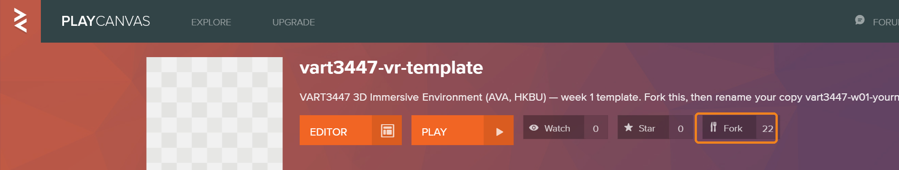

---

## Part 2 · Where you stand

The headset moves the **Camera**. You move the **Rig**.

{: start="2"}
2. Right-click **Root** → **New Entity**. Name it `Rig`.
   Drag **Camera** onto **Rig** so it sits inside.

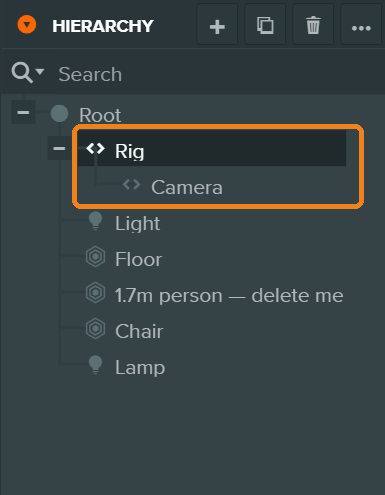

{: start="3"}
3. Click **Camera** → Position `0`, `1.6`, `0`.

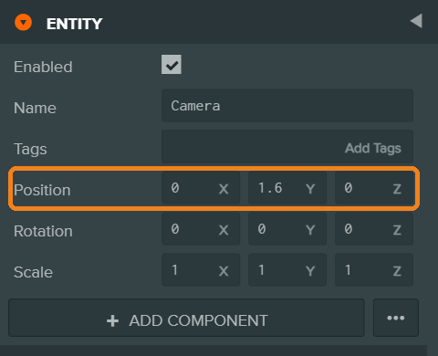

{: start="4"}
4. Click **Rig** → move it to where the visitor should **arrive**. Keep **Y = 0**. Turn it to face them the right way.

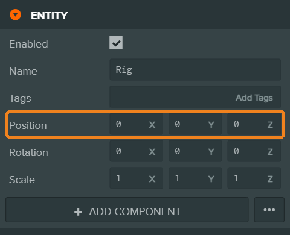

---

## Part 3 · Get the scripts

{: start="5"}
5. Template Editor in a second tab → **Assets › Scripts** → select all five → **Ctrl/Cmd + C**.
   Your project's tab → click in **Assets** → **Ctrl/Cmd + V**.

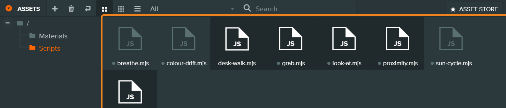

{: start="6"}
6. Open **your** `xr-enter.mjs`, delete everything, paste the new [xr-enter.mjs](../scripts/xr-enter.mjs), save. (Same name. One extra line — it lets the headset see your hands.)

7. Click **Rig** → **Add Component › Script › Add Script › deskWalk**.
   **Launch** ▶. Arrow keys walk, drag to look. This is your test room.

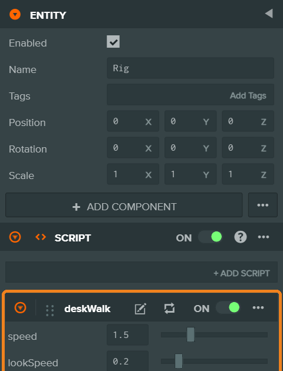

---

## Part 4 · One interaction

Pick **one**:

| | Put it on | What happens |
|---|---|---|
| **proximity** | the thing you walk up to | when you come close, the **Target** switches on |
| **lookAt** | the thing you look at | when you look at it for a moment, the **Target** switches on |
| **grab** | the thing you hold | pick it up, move it, let go — headset only |

{: start="8"}
8. Click the thing → **Add Component › Script**, then **+ Add Script** → choose one.

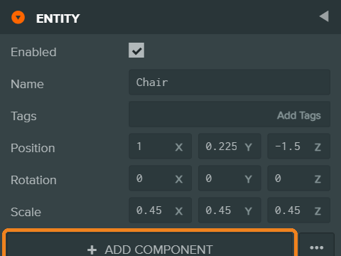
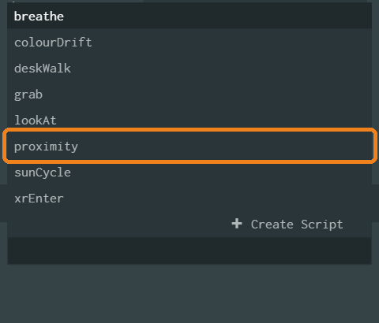

{: start="9"}
9. Drag what should change (a lamp, a box, a group) from the Hierarchy into the **Target** slot. (`grab` has no Target.)

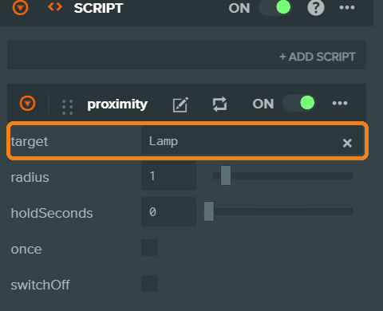

{: start="10"}
10. **Launch** ▶ and walk to it / look at it. Move the sliders until it feels right.

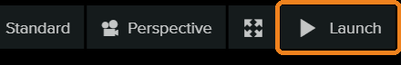

Sliders worth knowing:
**Radius** — how close. **Dwell Seconds** — how long a look has to last. **Hold Seconds** — how long it stays after you leave. **Switch Off** — the opposite: it's there until you come. **Once** — never goes back.

{: start="11"}
11. **At 4:05 pm: Publish → Set Primary Build → post in Week 03** (`Week 03 — Your Name`).

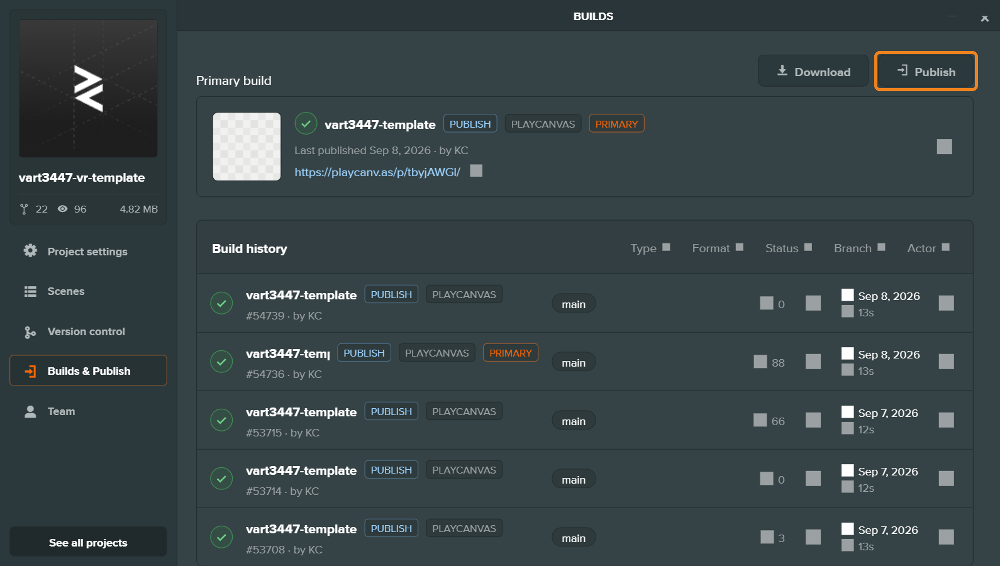
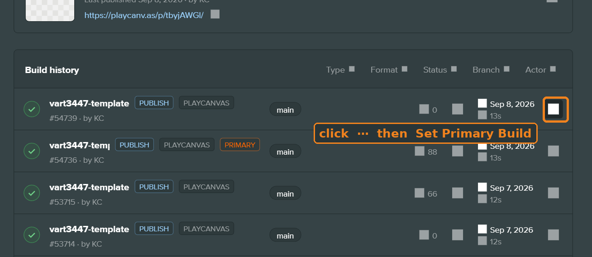

---

## Part 5 · After the break — change one thing (optional)

You may **keep** it as it is. Or:

{: start="12"}
12. Double-click the script in **Assets** and read it. Change a number.

13. Want more? Go to [How to ask Gemini](../gemini.md). The rules fit on one line: **start from a script that works · one change · you can explain every line you keep.**

14. If it breaks: **Launch** ▶ → open the console (Chrome: **F12** / **Cmd-Option-J**) → find the **red** line → paste it into Gemini with the script.

*(The red line looks like `Uncaught TypeError: …` — copy the whole line.)*

{: start="15"}
15. **At 5:25 pm: Publish → Set Primary Build.**

---

## Part 6 · Headset

{: start="16"}
16. Your **week-3** link. Arrive. Find your interaction without cheating. Do it, undo it, do it again.
    Using **grab**? Controllers on, TA's desk for pairing.

17. One fix. Publish, Set Primary Build, reload.

18. Two rooms from the **Week 03** column, no instructions from the owner. Comment on their post, signed:
    **what did you do, and what happened.**

19. On your own post: **what the visitor has to do, in one sentence — and whether anyone found it.**

---

## Next week

Bring **one object** — small, matte, not glass or shiny. You'll scan it with your phone. Install **Scaniverse** before class.

Read: Borges, "On Exactitude in Science." One paragraph. Twice.

---

## Troubleshooting

| What you see | Try this |
|---|---|
| No sliders after adding the script | File must end in `.mjs`. Click the script asset → **Parse**. Re-add it. |
| Nothing happens when I Launch | The **Target** slot is empty, or the script is on the wrong thing. See the table in Part 4. |
| It's already triggered when I arrive | **Radius** is bigger than the room, or the **Rig** is standing on it. |
| It flickers when I look around | **Dwell Seconds** is 0. Try 0.5–2. |
| The whole room disappeared | Your Target contains the thing the script is on. Move the script to a different entity. |
| I arrive at the ceiling / in the floor | Camera goes at `0, 1.6, 0` **inside** Rig. Rig's **Y = 0**. |
| I can't walk in the Launch window | `deskWalk` isn't on the **Rig**. Click inside the window first. |
| grab won't pick it up | Hand closer to the **centre** of the thing; raise **Radius**. Pull the **trigger**, not the grip. Controllers paired? |
| grab does nothing with hands | Your `xr-enter.mjs` is the old one. Redo step 6. |
| I pasted Gemini's code and now nothing works | Look for `pc.createScript` — that's the other language. Ask Gemini again with the [preamble](../gemini.md). |
| Red line in the console | Copy it. Paste into Gemini with the script: *"This error appeared. Explain in one sentence, then give me the whole corrected file."* Three tries, then a human. |
| Headset shows last week's room | Week 3 is a **new link**. Set Primary Build? |
| Testing on my iPhone doesn't work | It never will. Headset. |
