<!--
Drafted 28 Sep 2026. Splats first, mesh as fallback.
IMAGES: assets/img/week04/ 01–09 were recaptured at 2x on 28 Sep 2026 from SuperSplat 3.4.1 and the PlayCanvas Editor 2.33.2.
The demo splat is PlayCanvas's example guitar, standing in for a student scan.
Phone screens (Scaniverse) are not captured. If you want them, add 00a-scaniverse-splat.png, 00b-crop.png and 00c-export.png from your own phone tonight.
VERIFY tonight: the exact Scaniverse Classic labels ("Splat", crop, "Export"/"Share", SPZ/PLY).
-->

# Week 4 · The Captured Thing

**This week's rule:** Replace **one box** with **one real thing**.
It keeps its **real size**. Everything else stays boxes.
**By the end of today:** someone else has stood next to your real thing and said what the scan left out.

| | |
|---|---|
| Template | [playcanvas.com/project/1594630/overview/vart3447template](https://playcanvas.com/project/1594630/overview/vart3447template) |
| New scripts | [fit-scan.mjs](../scripts/fit-scan.mjs) · [teleport.mjs](../scripts/teleport.mjs) |
| Cleaning tool | [superspl.at/editor](https://superspl.at/editor), free, in the browser, no account |
| Class board | [padlet.com/chankachi/vart3447](https://padlet.com/chankachi/vart3447): **Week 04** column |

---

## Part 1 · Scan: inside or outside

**Bring** a small thing, **or find** a thing that can't be moved: a bollard, a hydrant, a railing end, a planter, a drain cover.

- **Shade.** Never in direct sun: the shadows get baked in, and your phone overheats.
- **Not taller than about 1.2 m.** You must be able to walk all the way round it.
- **Still.** Nothing that moves in the wind, and **no people** in the scan.
- Groups of three. **Back in the room at the time on the board.**

1. Open **Scaniverse** → new scan → **Splat**.
2. Walk a **slow** full circle round the object. Then again, lower. Then again, higher. **60–120 seconds.** Keep the whole object in the frame.
3. Stop. Let it **process** on the phone.
4. **Crop** tight to the object.
5. **Export → SPZ** (the smallest file). PLY also works.
6. Upload it to **Google Drive** (Drive app → **+** → **Upload**). iPhone and a Mac? **AirDrop** is faster.

---

## Play · two homes

Put your phone face up on the desk with the app open, so it keeps processing.

| Odd-numbered headset | Even-numbered headset |
|---|---|
| **Anne Frank House VR**: built by hand, from photographs and plans | **Home After War**: scanned with a camera |

Both deal with real loss (the Holocaust; war). If either is too heavy for you today, take the **splat link** on the board instead. You don't need to explain.

After, find someone who was in **the other house**:

1. Which home did you believe? What made you believe it, or stop?
2. One was built by hand, one was scanned. Where could you tell?
3. What did each one leave out? Who decided: a person, or the camera?

---

## Part 2 · Clean it (SuperSplat)

A splat keeps **everything** the camera saw: the floor, the wall, stray specks in the air. Keep only the object.

{: start="7"}
7. On the lab computer, download your file from **drive.google.com**.
   Open **[superspl.at/editor](https://superspl.at/editor)** and drag the file onto the page.
   Bottom right: **Splats** is how heavy your scan is (outlined).

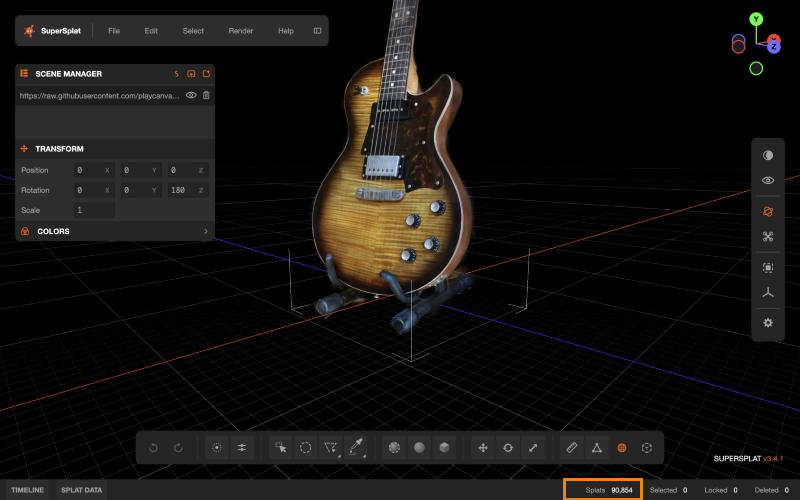

{: start="8"}
8. Click the **Polygon** tool (**P**). Click around everything that is **not** the object, and click the first point again to close the shape. It turns yellow.
   Press **Delete**. Turn the view (drag), and repeat until only the object is left.

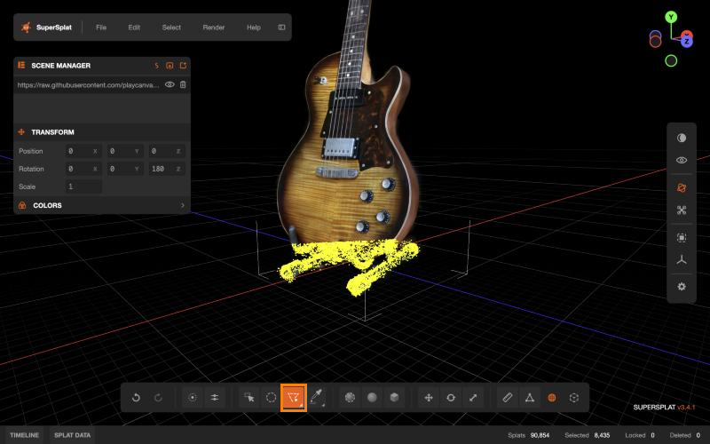
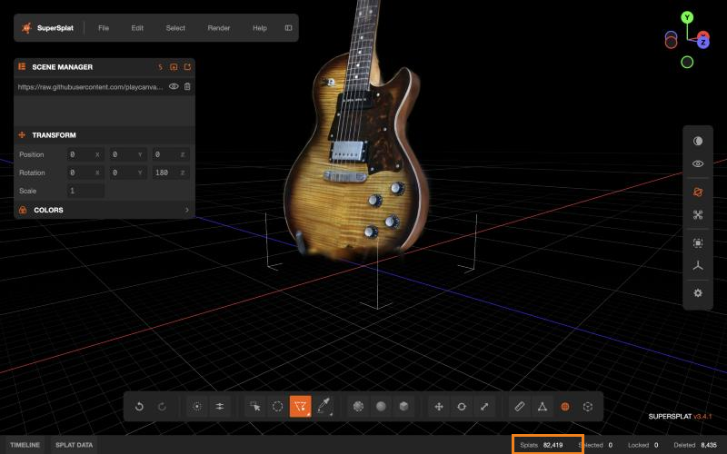

{: start="9"}
9. **Splats** under about **150,000**? Good. Over? Delete more.
10. **File → Export → SOG (.sog)**.

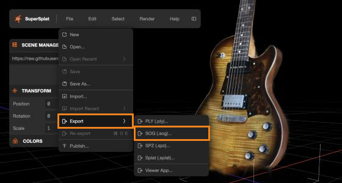

{: start="11"}
11. **Location**: your Downloads folder. **SH Bands: 0**. **Export**.

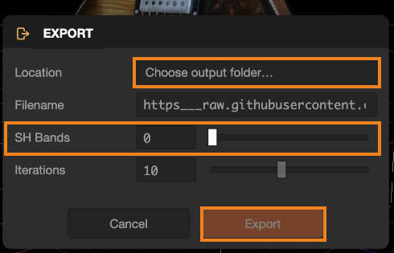

---

## Part 3 · Into your room

{: start="12"}
12. Open your **week-3** project → **Fork** → name it `vart3447-w04-yourname` → **Editor**.

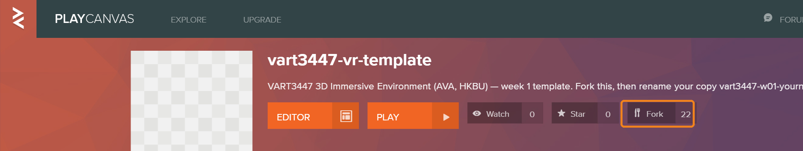

{: start="13"}
13. Drag your **.sog** file into **Assets**. **Once.** Wait for it to appear.

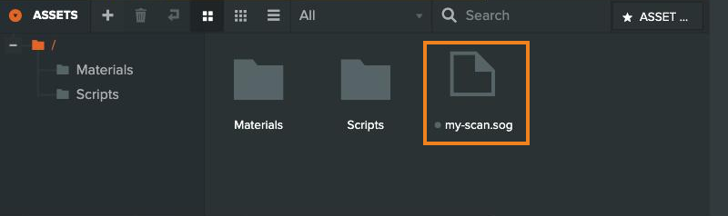

{: start="14"}
14. Drag it from **Assets** into the **Hierarchy**.
    **Can't see it?** Click it and press **F**. It may be under the floor, off to the side, or upside down. That's normal.

---

## Part 4 · Holder

A scan's centre point is often far away from the object. So we put it in a **Holder**, and from now on **the Holder is the object**.

{: start="15"}
15. Choose the **box** your real thing replaces. Note its **X** and **Z**.
16. Right-click **Root** → **New Entity**. Name it `Holder`.
    Position: the box's **X** and **Z**. **Y = 0** if it stands on the floor, or the height of the surface it stands on.
17. Drag the **scan** onto **Holder** so it sits inside.
    Upside down? Click the **scan** → Rotation **Z = 180**.
    Move the **scan** (not Holder) until it stands on Holder's arrows.
18. Click the **old box** → untick **Enabled**. Don't delete it: it goes grey.
    Tick it on: *the size you remembered.* Untick: *the size it is.*

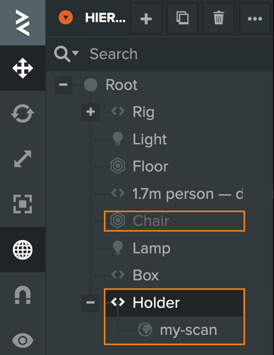

{: start="19"}
19. Click **Holder** → **Add Component › Script** → **+ Add Script** → **fitScan**.
    *(Not in the list? Copy `fit-scan.mjs` from the template's **Scripts** folder, like last week.)*

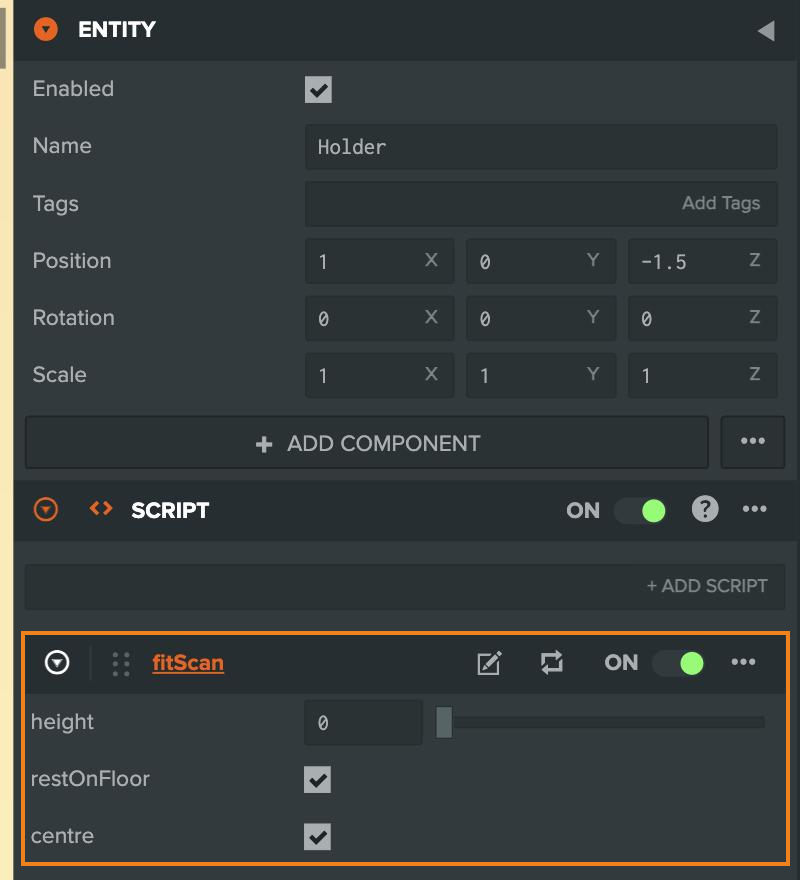

{: start="20"}
20. **Launch** ▶. Open the console (**F12**, or **Cmd-Option-J** on a Mac) and read the line:
    `fitScan: "Holder" is 0.31 m tall`.
    **Is that the height of the real thing?**

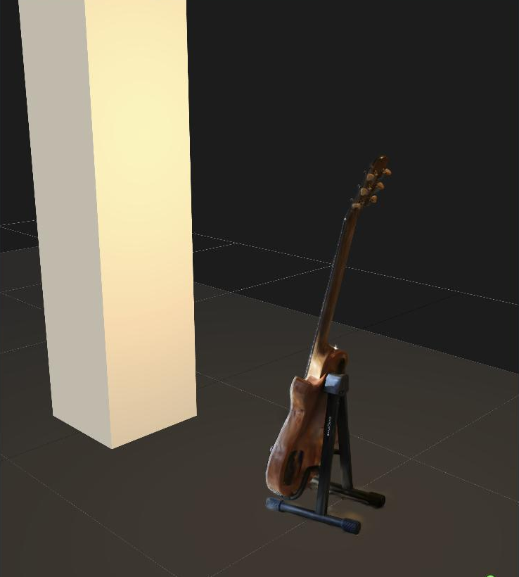

{: start="21"}
21. **When your teacher calls it: Publish → Set Primary Build → post in Week 04** (`Week 04 — Your Name`).

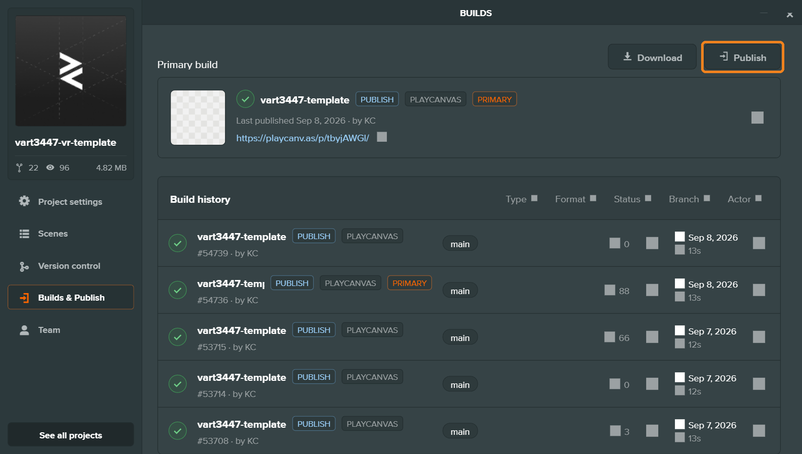
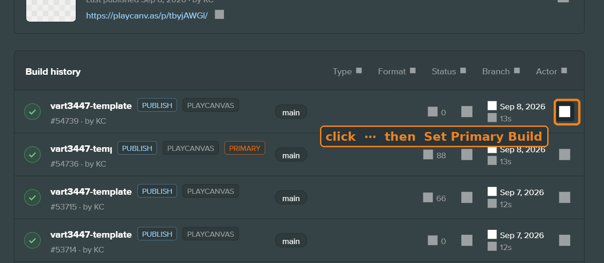

---

## Part 5 · Place, light, connect

{: start="22"}
22. **Place.** Stand where the visitor arrives (**Launch**, arrow keys). Can they find it? Turn **Holder** to hide the scan's bad side.
23. **Light.** Your lights can't touch a splat: **the light it was scanned in comes with it.** Choose:
    - **Agree:** turn your room's sun and lamps until they match the scan's light.
    - **Disagree:** leave them different. It's a photograph standing in your room.
24. **Connect.** Last week's interaction now uses the **Holder**:

| Last week you had | Now |
|---|---|
| **proximity** | put it on **Holder**. You walk up to the real thing. |
| **lookAt** / **proximity** with a Target | drag **Holder** into **Target**. The room *produces* the real thing. |
| **grab** | put it on **Holder**. The real thing, in your hand. |

Still **one** interaction.

{: start="25"}
25. **Walk round it.** Click **Rig** → **Add Script** → **teleport**.
    *(Not in the list? Copy `teleport.mjs` from the template's **Scripts** folder.)*
    Set **Max Distance** smaller than your room, so nobody lands inside a wall. Teleport doesn't count as your one interaction.
    How to use it in the headset: see **[Teleport](#teleport)** below.
26. **Before the headsets: Publish → Set Primary Build.**
27. Headset. **Turn your head fast.** If it stutters, see the troubleshooting table.
    Then teleport **all the way round** your real thing. Is there a side you tried to hide in step 22?
28. In **two** other people's posts, comment: **what the real thing is · what the scan left out.** Sign it.
29. On **your own** post: **agree or disagree (the light), and why.** One sentence.

---

## Teleport

In the headset you can only walk as far as your boundary. Teleport takes you further, so you can get all the way round your real thing.

1. Hold the **trigger** (under your index finger) and **keep holding**.
2. A line comes out of the controller. Point it **down at the floor**.
3. A ring appears where the line lands.
4. **Let go.** You're standing on the ring.

| You see | It means |
|---|---|
| **Green** line and ring | You can go there. Let go. |
| **Red** line and ring | Too far. Point closer. |
| **Red** line, no ring | You're not pointing at the floor. Point down. |
| **No line** | You're next to something you can grab, so the trigger grabs instead. Step back and try again. |

- You arrive **facing the same way**. To turn, turn your body.
- The line goes **through walls**. Don't aim through them.
- **Controllers only.** Your hands can grab, but they can't teleport.
- **Feel dizzy?** Stop. Stand still. Take the headset off.

**Settings** (click **Rig**, then look at **teleport**):

| Setting | What it does |
|---|---|
| **Max Distance** | How far one jump can go, in metres. Keep it smaller than your room. |
| **Floor Height** | Leave it at **0**, unless you built your floor higher up. |
| **Marker Size** | How big the ring is. |

---

## Next week

**Record one sound** with your phone: 30 seconds, not music, not speech.
If you found your thing outside, **go back and record it where it stands.**

Read: Nagel, "What Is It Like to Be a Bat?". The first ten pages. *(Moodle)*

---

## Troubleshooting

| What you see | Try this |
|---|---|
| No **Splat** option in Scaniverse | Update the app. Still nothing? Use a classmate's phone: one phone can make two scans. |
| "Phone too hot" / the camera turns off | Shade. Wait five minutes. Don't scan in the sun. |
| SuperSplat page is blank or grey | Use an up-to-date **Chrome** or **Edge**. |
| PlayCanvas won't take my `.spz` | Take it through **SuperSplat** first and export **SOG** (Part 2). |
| Dragged the file in and nothing appears | Click the scan in the Hierarchy and press **F**. Don't drag the file in again. |
| There are two scans | You dragged it in twice. Delete one from the Hierarchy. |
| It's upside down | Click the **scan** (not Holder) → Rotation **Z = 180**. |
| It floats above the floor, or fitScan says it's much too tall | There's leftover floor or fog in the scan. Back to **SuperSplat**, delete more, export again. |
| It's huge / tiny | The phone lost track. Type the real height (in metres) into **fitScan → Height**. |
| A foggy halo around the object | That's what a splat does at its edges. Delete more in SuperSplat, or keep it: it's a record. |
| fitScan says "put the scan inside this entity" | The scan is **beside** Holder. Drag it **onto** Holder. |
| No console line | fitScan is on the scan, not on **Holder**. Or you haven't pressed **Launch**. |
| proximity never fires / grab holds from far away | The script is on the scan. Put it on **Holder**. |
| The headset stutters since the scan arrived | Fewer splats: delete more in SuperSplat. Then **Settings → Rendering → Anti-Alias** off. Still stuttering? Tell us, and we'll switch you to mesh. |
| I pasted Gemini's code and now nothing works | Look for `pc.createScript`: that's the other language. Use the [preamble](../gemini.md). |
| No line when I pull the trigger | **teleport** isn't on the **Rig**, or you didn't publish. Or you're using your hands: teleport needs a **controller**. Next to your real thing? That pull is a grab: step back. |
| The line is red | Point **down** at the floor. Red with a ring: too far. Point closer, or raise **Max Distance** (but keep it inside your walls). |
| I landed inside a wall, or outside the room | **Max Distance** is bigger than your room. Make it smaller. |
| I pulled the trigger to teleport and nothing happened, next to my real thing | Something grabbable is within reach, so that pull is a **grab**. Step back from it, then aim. |
| Headset shows last week's room | Week 4 is a **new link**. Did you **Set Primary Build**? |
| Testing on my iPhone doesn't work | It never will. The phone is the camera; the headset is the screen. |
