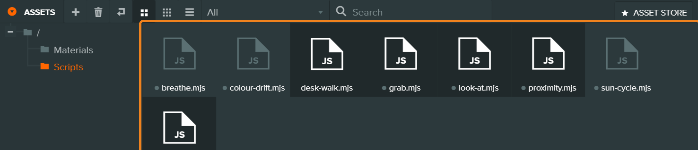
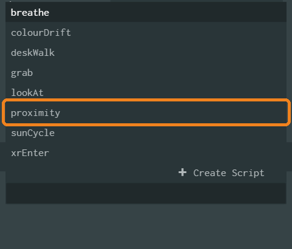
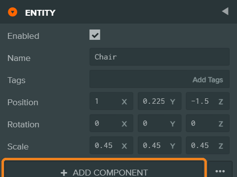
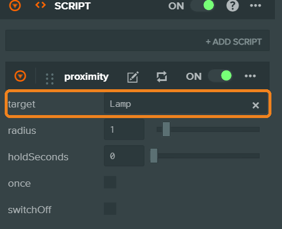

<!--
Drafted 5 Oct 2026.
IMAGES: reuses assets/img/week03/ (fork, copy scripts, add component, add script, target slot, publish, set primary).
SHOT-LIST, not yet captured (add to assets/img/week05/ and turn the captions into images):
  01-audio-asset.png    — Assets panel with an .m4a audio asset, selected, preview player visible.
  02-sound-child.png    — Hierarchy: Holder › (scan) + Sound; Sound selected.
  03-sound-component.png — Sound component inspector: Positional ticked, Ref Distance 1, Max Distance 4 boxed; slot with Asset, Loop, Auto Play boxed.
  04-ears.png           — Camera with ears attached (Spatial ticked, Show Reach unticked).
  05-reach.png          — Launch window with Show Reach on: two pale bubbles round the thing; console line visible.
VERIFY tonight on a Quest 2 and in the live Editor: the Sound component's labels and default Max Distance; whether a new Sound component already has a slot or needs ADD SLOT; that .m4a imports as Audio; that sound starts without a second tap in the headset.
Lightman dates: check against the Moodle copy.
-->

# Week 5 · Eyes Closed

**This week's rule:** Your room must still mean something **with your eyes shut**.
At least **one sound you recorded** lives in a **thing**.
Still **one** interaction. **Silence counts.**
**By the end of today:** someone has stood in your room with their eyes shut and pointed to where your sound is.

| | |
|---|---|
| Template | [playcanvas.com/project/1594630/overview/vart3447template](https://playcanvas.com/project/1594630/overview/vart3447template) |
| New scripts | [ears.mjs](../scripts/ears.mjs) · [hush.mjs](../scripts/hush.mjs) |
| Class board | [padlet.com/chankachi/vart3447](https://padlet.com/chankachi/vart3447): **Week 05** column |

**At the computer, wear earphones.** Twenty rooms playing at once is noise.

---

## Play · listen

Headset on, controllers in hand, sitting down. **Emperor**: a daughter, and her father who has lost his words.

It deals with a parent's illness and loss of speech. If it's too much, take the headset off. You don't need to explain.

At some point it will ask you to do something, and you'll fail. Notice whose failure it feels like.

After:

1. Shut your eyes for a minute inside the piece. **What did you lose? What didn't you?**
2. When you failed, whose failure was it: yours, the headset's, or his?
3. Where was her voice? **Could you point to it?** Where was his?

---

## Record · outside

Groups of three. One records; the other two stay **silent**.
**Back in the room at the time on the board.**

- **One sound, where it lives.** A gate, a drain, a vending machine, an aircon unit, a stairwell, a bus stop.
- **Found your object outside last week?** Go back and record it where it stands.
- **Not music, not speech, no one's voice.** Don't record people.
- **A hand's width** from the source. From 3 m away, a recording is mostly the place.
- **Out of the wind.** Wind on a phone mic sounds like a roar. Shelter in a doorway or a stairwell, or turn your back to the wind.

1. Open your phone's voice recorder (iPhone: **Voice Memos**).
2. Record **30 seconds**. Then two more takes.
3. **Listen back on earphones.** Keep the best one.
4. Upload it to **Google Drive** (Drive app → **+** → **Upload**), or **AirDrop** it to a Mac.

---

## Part 1 · This week's copy

1. Open your **week-4** project → **Fork** → name it `vart3447-w05-yourname` → **Editor**.

{: start="2"}
2. On the computer, download your recording from **drive.google.com** (or find it in **Downloads** if you AirDropped it).
3. Drag the file into **Assets**. **Once.** Click it: you can play it there.
   *`.m4a`, `.mp3`, `.wav` all work.*

*[Image to come: your sound in Assets]*

---

## Part 2 · Ears

{: start="4"}
4. Template in a second tab → **Assets › Scripts** → select **ears** and **hush** → **Ctrl/Cmd + C**.
   Your tab → click in **Assets** → **Ctrl/Cmd + V**.

{: start="5"}
5. Click **Camera** (inside **Rig**) → **Add Component › Script** → **+ Add Script** → **ears**.
   Leave **Spatial** ticked.

**Ears go on the Camera.** The Camera is your head.

---

## Part 3 · One sound in one thing

Which thing makes the sound? Often it's your **real thing** from last week.

{: start="6"}
6. Right-click that thing (e.g. **Holder**) → **New Entity**. Name it `Sound`.
   It sits **inside** the thing, so it goes where the thing goes.

*[Image to come: Holder with Sound inside]*

{: start="7"}
7. Click **Sound** → **Add Component** → **Sound**.

{: start="8"}
8. Set:

| Setting | Set it to |
|---|---|
| **Positional** | ticked: the sound comes **from this place** |
| **Ref Distance** | `1`: full volume within 1 m |
| **Max Distance** | `4`: silent beyond 4 m. **Don't skip this.** |
| Slot → **Asset** | drag your sound here (no slot? press **ADD SLOT**) |
| Slot → **Loop** | ticked |
| Slot → **Auto Play** | ticked |

*[Image to come: the Sound component]*

{: start="9"}
9. **Launch** ▶. **Click once** in the window (sound needs a click to start).
   Walk with the arrow keys. Turn your back to it.
10. Open the console (**F12**, or **Cmd-Option-J** on a Mac). Read the line:
    `ears: "Sound" is full volume within 1 m, silent beyond 4 m.`

---

## Part 4 · See where it reaches

{: start="11"}
11. Click **Camera** → **ears** → tick **Show Reach**. **Launch**.
    **Small bubble:** full volume. **Big bubble:** you can hear it. **Outside:** silence.

*[Image to come: the bubbles in the Launch window]*

{: start="12"}
12. **Where in your room is it silent?** That's part of the room too.
13. **Untick Show Reach.**
14. **When your teacher calls it: Publish → Set Primary Build → post in Week 05** (`Week 05 — Your Name`).

---

## Part 5 · Choose a shape

Still **one** interaction.

| Shape | How | Interaction? |
|---|---|---|
| **It lives in a thing** | what you have now | no: keep last week's interaction |
| **Your interaction makes it** | your **proximity** or **lookAt** → drag **Sound** into **Target** | yes: it's the same one |
| **A place of silence** | **hush** on a spot (below) | yes: it **replaces** last week's |

**hush:**

{: start="15"}
15. Right-click **Root** → **New Entity** → name it `Quiet`. Put it where the silence should be. **Y = 0.**
16. **Add Component › Script** → **hush**.
17. Stand there (Launch, arrow keys): every **other** sound fades away.
18. Want a sound you can **only** hear in the silence? Give **Quiet** its own `Sound` inside it, with a small **Max Distance** (`1.5`). hush leaves its own sounds alone.

| hush setting | What it does |
|---|---|
| **Radius** | how close you stand, in metres |
| **Level** | how loud the rest stays. `0` = silence |
| **Fade Seconds** | how slowly the room goes quiet, and comes back |

**A second or third sound?** Only if it earns its place. **Four at most.**

{: start="19"}
19. **Before the headsets: Show Reach off → Publish → Set Primary Build.**

---

## Part 6 · Eyes shut, then open

In pairs. One headset.

1. **Guide:** open your partner's link, enter the room, hand over the headset. Hand on their shoulder.
2. **Visitor: eyes shut.** Turn, crouch, reach. **Don't walk.**
   Say what you hear. **Point** to where it is.
3. **Eyes open.** Look where you pointed.
4. Comment on their post: **what I heard · where it was · what my eyes changed.** Sign it.

Swap. Then change partners and do it again.

{: start="20"}
20. On **your own** post: **where is it silent in your room, and why there?** One sentence.

---

## Next week

**Week 6 is the mid-term.** You present this room. Details on the week 6 page.

Read: Alan Lightman, *Einstein's Dreams*, three dreams *(Moodle)*:
**14 April 1905** (time is a circle) · **24 April 1905** (two times) · **14 May 1905** (where time stands still).

---

## Troubleshooting

| What you see | Try this |
|---|---|
| My recording is a roar | That's wind. Record again in a doorway or a stairwell. |
| No sound at all | **Click once** in the Launch window. Check the Slot has your file in **Asset**, and **Auto Play** is ticked. |
| No sound in the headset | Headset volume: buttons under the headset's right side. Did you **Publish → Set Primary Build**? |
| The sound is everywhere, the same from every side | **Max Distance** is still huge. Set it to `4`. The console says so. |
| It's louder in one ear but doesn't come *from* the thing | **ears** isn't on the **Camera**. Put it there, not on the Rig. |
| It comes from the middle of the room, not from the thing | **Positional** is unticked, or the **Sound** entity isn't inside the thing. |
| The thing disappears when my interaction fires | Your **Target** is the thing. Make it the **Sound** inside it. |
| A tiny gap or click when it loops | That's the file format. Keep it (it's a breath), or record a longer take. |
| My recording is mostly noise | You were too far away. Record closer: a hand's width. |
| Two copies of my sound | You dragged it in twice. Delete one from **Assets**. |
| hush does nothing | Is there another sound in the room? hush only quiets **other** sounds. Is **Level** at `1`? |
| No Spatial / Show Reach ticks | Click the script asset → **Parse**. Re-add it. |
| The bubbles are in my published room | Untick **Show Reach**, publish again. |
| The headset stutters since I added sounds | Fewer sounds. Four at most. |
| I pasted Gemini's code and now nothing works | Look for `pc.createScript`: that's the other language. Use the [preamble](../gemini.md). |
| Headset shows last week's room | Week 5 is a **new link**. Did you **Set Primary Build**? |
| Testing on my iPhone doesn't work | It never will. The phone records; the headset plays. |
